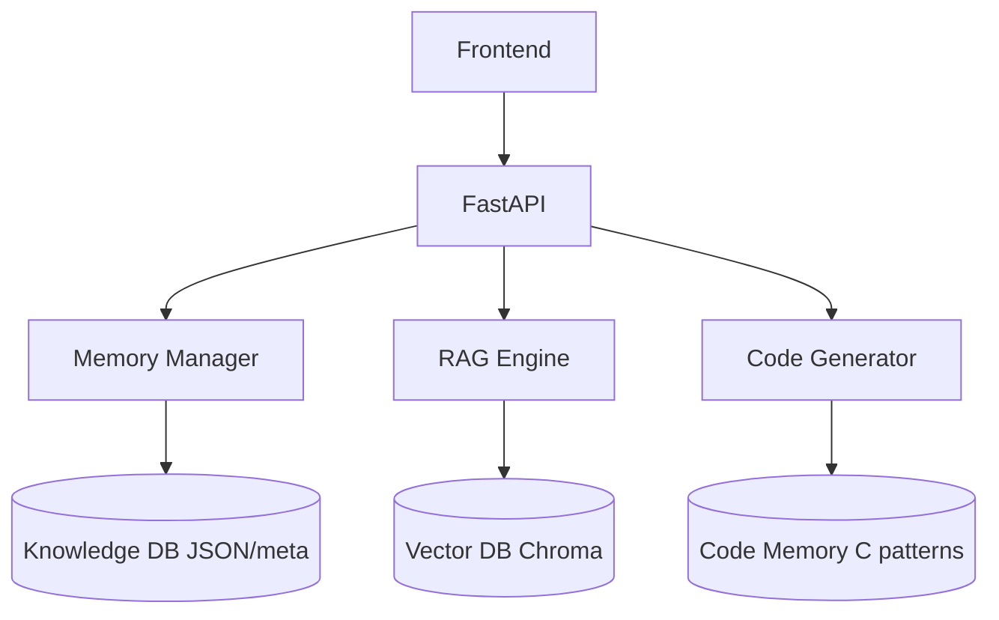

# 🚀 Next Step: Persistent Knowledge Memory Layer for RAG

## 🎯 Goal

Build a **Document Memory System** that:

* Stores every uploaded document permanently
* Makes it searchable across projects
* Reuses knowledge for future generations
* Tracks versions + context evolution

---

# 🧠 1. Introduce a Knowledge Base Layer (Core Change)

Right now you likely use:

* `ChromaDB` → temporary / per-run embeddings

👉 Upgrade to:

### ✅ Persistent Multi-Collection Design

```
/knowledge_base/
  ├── projects/
  │     ├── project_A/
  │     │     ├── documents/
  │     │     ├── embeddings/
  │     │     ├── metadata.json
  │     │     └── versions/
  │     └── project_B/
  │
  ├── global_library/
  │     ├── protocols/
  │     ├── standards/
  │     └── reusable_patterns/
```

---

## 🧩 Collections Strategy (VERY IMPORTANT)

Instead of one vector DB:

| Collection Type       | Purpose                        |
| --------------------- | ------------------------------ |
| `project_<id>`        | Project-specific requirements  |
| `global_knowledge`    | Reusable engineering knowledge |
| `code_patterns`       | Generated + validated code     |
| `traceability_memory` | Requirement relationships      |

---

# 🔁 2. Add Document Memory Lifecycle

Every upload should follow this pipeline:

```
UPLOAD → PARSE → CHUNK → EMBED → STORE → VERSION → LINK
```

### 📌 Store This Metadata

```json
{
  "doc_id": "uuid",
  "project_id": "proj_123",
  "version": "v1.2",
  "source": "pdf",
  "uploaded_at": "timestamp",
  "tags": ["UART", "protocol", "safety"],
  "embedding_ids": [...],
  "summary": "...",
  "hash": "content_hash"
}
```

---

# 🧠 3. Add “Memory-Aware Retrieval”

Your current RAG:

```
query → similarity search → generate
```

Upgrade to:

```
query → 
    project memory →
    global memory →
    past generated docs →
→ merge context → generate
```

### 🔥 Smart Retrieval Logic

* Priority 1 → Current project
* Priority 2 → Similar past projects
* Priority 3 → Global engineering knowledge

---

# 🧬 4. Add Versioning + Diff Memory

This is a **game changer** for engineering systems.

When a document is re-uploaded:

### ✅ Detect changes using hash

```python
if new_hash != old_hash:
    create new version
    store diff
```

### Store:

* Previous requirements
* New requirements
* Delta (added/removed/modified)

---

# 🤖 5. Add Learning Loop (Self-Improving RAG)

After generation:

### Store outputs back into memory:

* Generated SyRS / SRS / SDD
* Generated C code
* User edits (VERY IMPORTANT)

👉 This becomes **training signal for future retrieval**

---

# 🧠 6. Introduce Memory Types

| Memory Type           | Example                  |
| --------------------- | ------------------------ |
| **Semantic Memory**   | Embeddings (ChromaDB)    |
| **Structured Memory** | JSON requirements        |
| **Relational Memory** | Traceability links       |
| **Procedural Memory** | Code generation patterns |

---

# ⚙️ 7. Backend Changes (Concrete Tasks)

### In `rag.py`

* Add:

```python
def store_document_memory(doc, project_id):
def retrieve_multi_source(query, project_id):
```

---

### In `extractor.py`

* Add:

```python
def generate_document_summary():
def generate_tags():
```

---

### New Module: `memory_manager.py`

```python
class MemoryManager:
    def store_document(self, doc):
    def version_document(self, doc):
    def retrieve_context(self, query):
    def link_documents(self):
```

---

# 🧩 8. Frontend Changes

### Add:

* 📂 Project Knowledge Viewer
* 🧠 “Memory Used” panel during generation
* 🔍 Search across all past documents
* 🕓 Version history viewer

---

# 🔥 9. Advanced (High Impact Features)

## ✅ A. Context Compression

Store summaries + key embeddings → faster retrieval

## ✅ B. Hybrid Search

Combine:

* Vector search
* Keyword search (BM25)

## ✅ C. RAG Cache

Cache frequent queries → reduce LLM cost

---

# 🧪 10. Validation Plan

### Test Cases

* Upload same doc twice → version created
* Generate SRS → uses past SyRS
* New project → reuses similar protocol knowledge
* Modify requirement → diff detected

---

# 🧠 Final Architecture Upgrade



---

# 🧭 What You Should Do Next (Priority Order)

### ✅ Step 1 (Must Do First)

Implement:

* `MemoryManager`
* Persistent storage structure
* Metadata tracking

---

### ✅ Step 2

Add:

* Multi-source retrieval (project + global)

---

### ✅ Step 3

Add:

* Versioning + diff tracking

---

### ✅ Step 4

Store:

* Generated outputs back into memory

---

### ✅ Step 5 (Advanced)

Add:

* Learning loop + ranking improvements

---

# 💡 Key Insight

You are transitioning from:

👉 **RAG system**
➡️ to
👉 **Engineering Knowledge Operating System**
